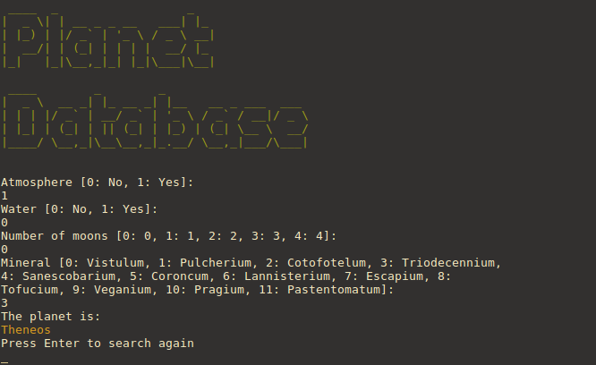
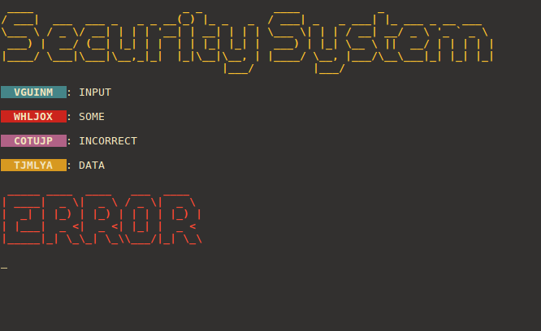
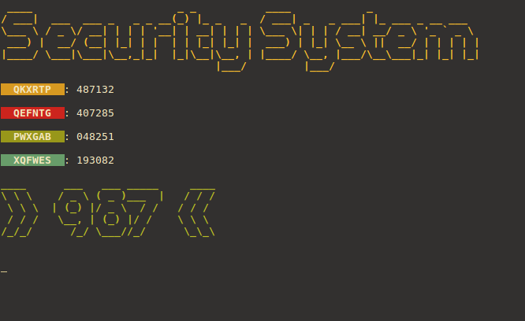

# Escape Room

Scripts used in an escape room that I co-designed. Originally deployed on [C.H.I.P](https://getchip.com/pages/chip) and [PocketC.H.I.P](https://getchip.com/pages/pocketchip) hardware.

## Planet Database

Deployed on PocketC.H.I.P. Asks a series of questions and returns the name of a planet that fits the description.

## Security System

Deployed on C.H.I.P. Asks for 4 different security codes (each with a different color). If the codes are incorrect, displays an error message and resets, otherwise shows the padlock combination.

